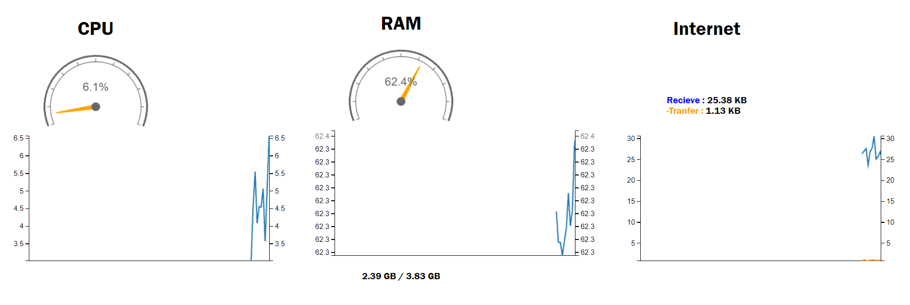
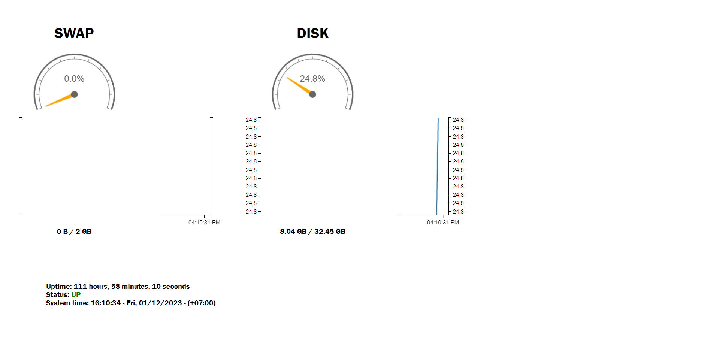

<div style="text-align: center;">
    <p style="font-size: 40px; font-weight: bold;">Monitor System</p>
    <p style="font-size: 20px; font-weight: bold;">System monitoring supports linux and windows</p>
</div>
<div style="text-align: center;">

</div>

## The monitor system project
With the desire to create a monitoring system with monitoring functions, I created this project to serve the most basic parameters monitoring of my server. Along with the simplest interface possible. (because I'm pretty bad at interface design). 

Use <a href="https://github.com/epochjs/epoch">epochjs</a> to create interface, use the os module (available in nodejs) and <a href="https://github.com/sebhildebrandt/systeminformation">systeminfomation</a> to get system parameters

## Installation
```bash
git clone https://github.com/ttthanhf/monitor-system.git
```
```bash
cd monitor-system
```
```bash
npm i
```
As default : It's will start at localhost and port 10000
```bash
npm start
```
Customize: 
```bash
npm start <your-host>
```
Example: npm start https:example.com

## Functionalitys
1. CPU ( percent used )

2. RAM ( percent used, used, total )

3. Internet receive and tranfer

4. SWAP ( percent used, used, total )

5. DISK ( percent used, used, total )

6. Server uptime

7. System status

8. System time

## UI



## Comments and issues
I am very happy to discuss any comments, ideas, issues and suggestions. Please do not hesitate to contact me.